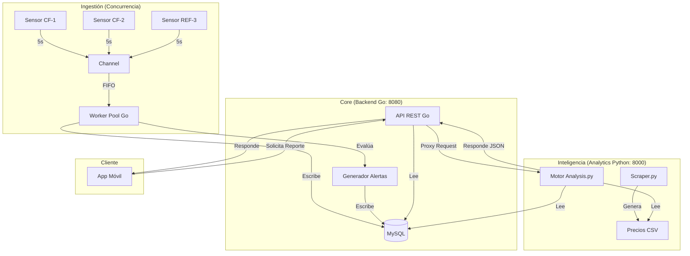

# Arquitectura y Flujo del Sistema (Integración)

## 1. Mapa de Comunicación
El sistema Rukito funciona como un ecosistema de componentes especializados que se comunican mediante HTTP y una base de datos compartida.

---

## 2. El Ciclo de Vida de un Dato (End-to-End)

Para entender cómo funciona el sistema en conjunto, sigamos el rastro de una lectura de temperatura:

1.  **Generación:** Una Goroutine en Go genera una temperatura de `-16°C` para la cámara `CF-1`.
2.  **Tránsito Interno:** El dato viaja por un canal seguro hasta el `Worker Pool`.
3.  **Cálculo Instantáneo:** Go nota que la temperatura anterior era `-20°C`. Calcula instantáneamente un $dT/dt$ positivo alto.
4.  **Persistencia y Alerta:** 
    *   Go guarda la lectura en MySQL. 
    *   Como `-16°C` supera el umbral, Go crea una Alerta Crítica en la tabla `alerts`.
5.  **Solicitud de Análisis:** El usuario abre la App y pide un reporte. El Backend Go recibe la petición y llama al Servicio de Python.
6.  **Procesamiento Profundo:** 
    *   Python lee el historial de MySQL (donde Go ha estado escribiendo).
    *   Python lee los precios de mercado del CSV.
    *   Aplica la **Regla de las 4 horas** y calcula que esos `-16°C` representan un riesgo de **$1,200 USD**.
7.  **Entrega:** El JSON con el costo calculado viaja de Python a Go, y de Go a la App Flutter.

---

## 3. Puntos Críticos de Integración

*   **Base de Datos Compartida:** MySQL es el punto de encuentro. Go escribe el 99% de los datos, Python los lee para generar inteligencia.
*   **API Gateway:** El servidor Go actúa como punto de entrada único para el Frontend. El Frontend nunca habla directamente con Python; esto permite que Python sea un microservicio interno "invisible" y seguro.
*   **Consistencia Temporal:** El sistema usa la última lectura de la base de datos como referencia para los cálculos de tiempo, lo que permite que el análisis sea exacto incluso si hay desajustes de reloj entre los servidores.

---

## 4. Próximos Pasos para Escalar
*   **WebSockets:** Implementar notificaciones push desde Go cuando se detecte una alerta en el Worker Pool.
*   **Caché (Redis):** Mover los mapas de `lastStates` de Go a un caché distribuido si se decide usar múltiples servidores backend.
*   **Contenedores:** Dockerizar los tres servicios (Go, Python, MySQL) para un despliegue en la nube en un solo clic.
