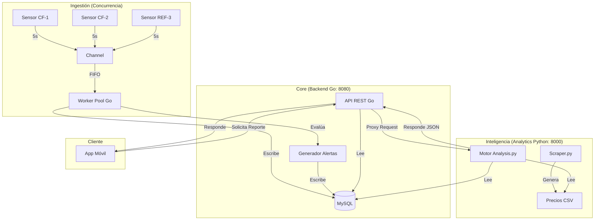

# Arquitectura y Flujo del Sistema (Integración)

## 1. Mapa de Comunicación
El sistema Rukito funciona como un ecosistema de componentes especializados que se comunican mediante HTTP y una base de datos compartida.

```mermaid
graph TD
    subgraph "Ingestión (Concurrencia)"
        S1[Sensor CF-1] -- 5s --> Channel
        S2[Sensor CF-2] -- 5s --> Channel
        S3[Sensor REF-3] -- 5s --> Channel
        Channel -- FIFO --> Worker[Worker Pool Go]
    end

    subgraph "Core (Backend Go: 8080)"
        Worker -- Escribe --> DB[(MySQL)]
        Worker -- Evalúa --> Alertas[Generador Alertas]
        Alertas -- Escribe --> DB
        API[API REST Go] -- Lee --> DB
    end

    subgraph "Inteligencia (Analytics Python: 8000)"
        Analista[Motor Analysis.py] -- Lee --> DB
        Scraper[Scraper.py] -- Genera --> CSV[Precios CSV]
        Analista -- Lee --> CSV
    end

    subgraph "Cliente"
        Flutter[App Móvil] -- Solicita Reporte --> API
        API -- Proxy Request --> Analista
        Analista -- Responde JSON --> API
        API -- Responde --> Flutter
    end
```

---

## 2. El Ciclo de Vida de un Dato (End-to-End)

Para entender cómo funciona el sistema en conjunto, sigamos el rastro de una lectura de temperatura:

1.  **Generación:** Una Goroutine en Go genera una temperatura de `-9°C` para la cámara `CF-1`.
2.  **Tránsito Interno:** El dato viaja por un canal seguro hasta el `Worker Pool`.
3.  **Evaluación Granular:** 
    *   Go consulta su caché de configuración (`alert_configs`).
    *   Detecta que `-9°C` es mayor que el *Umbral Crítico Calor* (`-10°C`).
    *   Asigna el estado `CRITICAL_HOT`.
4.  **Persistencia y Alerta:** 
    *   Go guarda la lectura en MySQL con el status calculado.
    *   Genera una Alerta con severidad `CRITICAL` y categoría `HOT_TEMP` en la tabla `alerts`.
5.  **Solicitud de Análisis:** El usuario abre la App y pide un reporte. El Backend Go recibe la petición y llama al Servicio de Python.
6.  **Procesamiento Profundo:** 
    *   Python lee el historial de MySQL (aplicando *downsampling* si el rango es > 24h).
    *   Calcula el tiempo acumulado en zona de peligro (`hours_at_risk`).
    *   Infiere la causa probable (ej: "Puerta Abierta") basándose en la frecuencia de alertas `HOT_TEMP`.
7.  **Entrega:** El JSON con el costo financiero y el diagnóstico viaja de Python a Go, y de Go a la App Flutter.

---

## 3. Puntos Críticos de Integración

*   **Base de Datos Compartida:** MySQL es el punto de encuentro. Go escribe el 99% de los datos, Python los lee para generar inteligencia.
*   **API Gateway:** El servidor Go actúa como punto de entrada único para el Frontend. El Frontend nunca habla directamente con Python; esto permite que Python sea un microservicio interno "invisible" y seguro.
*   **Consistencia Temporal:** El sistema usa la última lectura de la base de datos como referencia para los cálculos de tiempo, lo que permite que el análisis sea exacto incluso si hay desajustes de reloj entre los servidores.

---

## 4. Próximos Pasos para Escalar
*   **WebSockets:** Implementar notificaciones push desde Go cuando se detecte una alerta en el Worker Pool.
*   **Caché (Redis):** Mover los mapas de `lastStates` de Go a un caché distribuido si se decide usar múltiples servidores backend.
*   **Contenedores:** Dockerizar los tres servicios (Go, Python, MySQL) para un despliegue en la nube en un solo clic.
